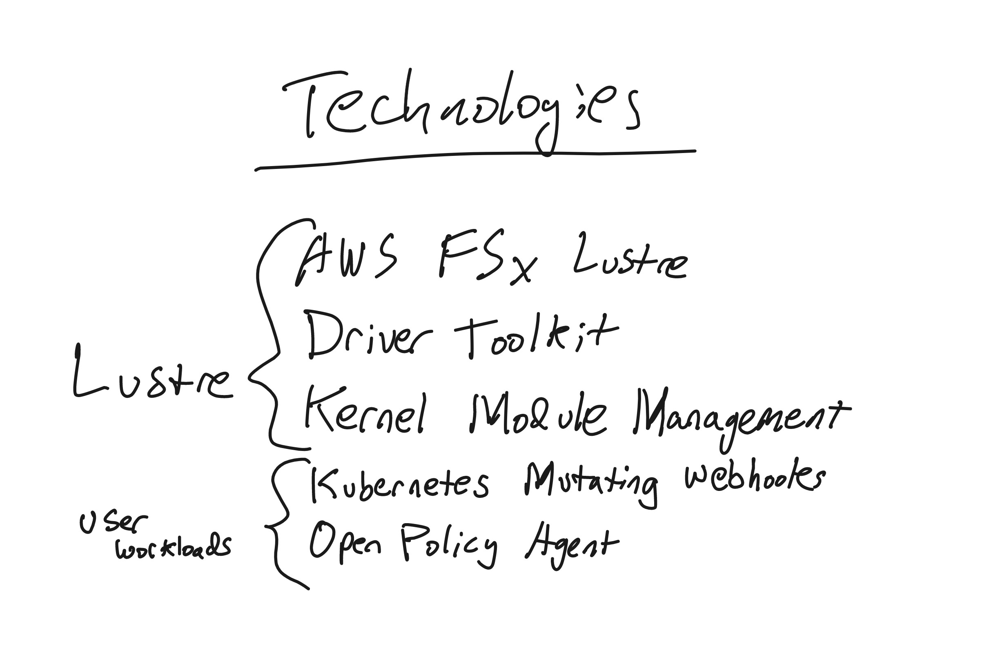
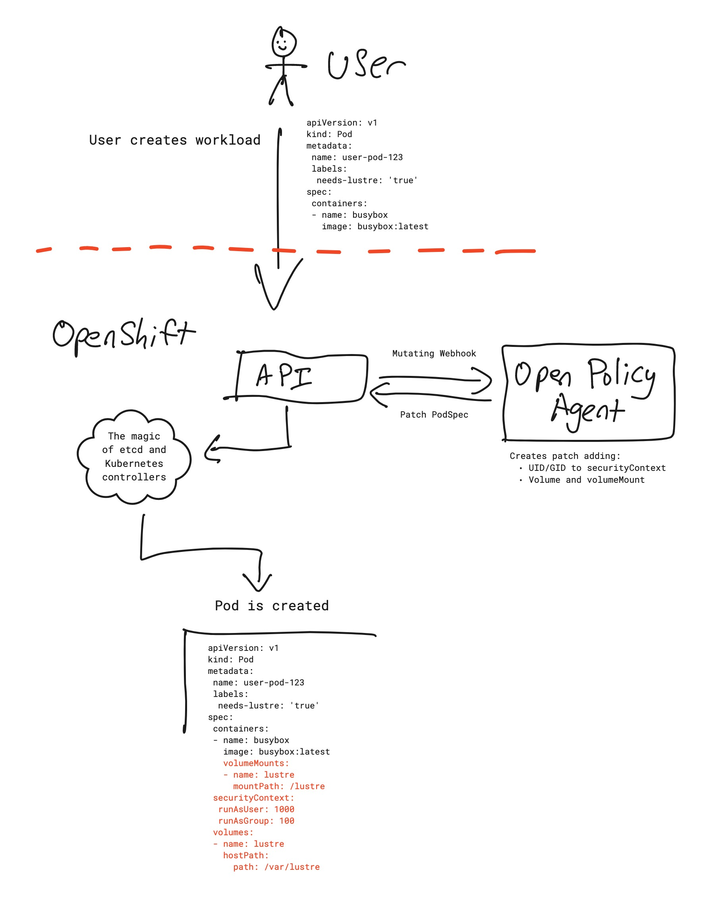

# Lustre on OpenShift

This shows how it is possible to mount Lustre (in this case AWS FSx Lustre) on
OpenShift and use it similar to a HPC environment.

We will be:

- Building the kernel modules using the Kubernetes Kernel Module Management operator
and OpenShift's Driver Toolkit image
- Mounting the Lustre filesystem on Red Hat CoreOS worker nodes in an OpenShift Cluster
- Dynamically patching user workloads to bind mount Lustre into Pods with Open Policy Agent

## Building Lustre for Red Hat CoreOS

Red Hat CoreOS is based on RHEL but uses an extended update kernel and in order to make
it easier to build kernel modules we have the [Driver Toolkit](https://docs.openshift.com/container-platform/4.12/hardware_enablement/he-driver-toolkit.html) available which contains
all of the kernel development headers for a particular release of OpenShift.

In the past we developed an operator to help manage specialized resources on OpenShift
(Special Resource Operator) but we are migrating to a collaborative effort upstream to
manage kernel modules for Kubernetes called the Kernel Module Management operator.

* Upstream: [github](https://github.com/kubernetes-sigs/kernel-module-management)
* Midstream: [github](https://github.com/rh-ecosystem-edge/kernel-module-management) and [docs](https://openshift-kmm.netlify.app/)
* Downstream: coming soon!

### Deploying the Kernel Module Management operator

Kernel Module Management operator (pulling from midstream until deployed into catalogs) [installation documentation](https://github.com/rh-ecosystem-edge/kernel-module-management/blob/main/docs/mkdocs/documentation/install.md)

```
$ oc apply -k https://github.com/rh-ecosystem-edge/kernel-module-management/config/default
```

### Create Module Custom Resources

In the root of this git repository we are using kustomize which will deploy our Module custom resources (in kmm.yaml)
as well as our MachineConfig which will disable SELinux on the worker nodes which is [incompatible with Lustre](https://access.redhat.com/solutions/31981).

(We also need to give the KMM operator access to the privileged SCC although this should be fixed in midstream.)

We are lazily labeling all nodes with `feature.kmm.lustre=true` to enable the KMM operator but we really only
need the worker nodes.

```
$ git clone ...

$ oc new-project lustre
$ oc apply -k .
$ oc adm policy add-scc-to-user privileged -z default
$ oc get nodes -o name | xargs -I{} oc label {} feature.kmm.lustre=true
```

### Building the Lustre kernel module container image

The KMM operator will kick off a OpenShift Build using the Dockerfile in this repository. Currently this build pulls
the source RPMs from the AWS FSx RPM repositories and rebuilds them for the Red Hat CoreOS kernel. Once the build
completes it will create DaemonSets to insert the kernel modules on the nodes with the `feature.kmm.lustre=true` label.

### Mounting Lustre on RHCOS

In order to mount the filesystem we need to create a DaemonSet that handles the mount/umount.

A simple daemonset is provided in `daemonset-mount.yaml` in the repository but will need to be adjusted for the correct
mount point.

The most important part of the spec is ensuring that we have bidirectional mount propagation between the host and container:

```yaml
apiVersion: apps/v1
kind: DaemonSet
spec:
  template:
    spec:
      containers:
        - volumeMounts:
          - name: host
            mountPath: /host
            mountPropagation: Bidirectional
      volumes:
      - name: host
        hostPath:
          path: /
```

## Mutating Webhooks with Open Policy Agent

In order to dynamically patch user workloads with the correct UIDs and volume mount information
we can use a built-in feature of the Kubernetes API server called [admission webhooks](https://kubernetes.io/docs/reference/access-authn-authz/extensible-admission-controllers/).
This let's us access each API request as it comes in to Kubernetes to either accept,
modify, or reject the request.

### Deploying Open Policy Agent and MutatingWebhookConfiguration

Open Policy Agent is just one way of achieving this goal including others such as Kyverno or even the Operator-SDK to
build a webhook receiver with the Kubernetes Golang scaffolding.

One thing to note here is that misconfigured validating and mutating webhooks can severely impair your cluster so we
take care to ensure that our blast radius is as tight as possible and encompasses only user workloads and not cluster-critical workloads:

- Scope our webhook configuration to exactly what we need by setting the rule to only CREATE operations on namespace-scoped resources

```
  - operations: ["CREATE"]
    apiGroups: ["*"]
    apiVersions: ["*"]
    resources: ["*"]
    scope: "Namespaced"
```
- Set a namespace selector on our webhook configuration to only apply to namespaces with our label: `openpolicyagent.org/webhook=`
- Set our webhook configuration to `failurePolicy: Fail` to ensure that we fail closed, user workloads will not be created if OPA is unable to handle requests 

We also need to label all of our user namespaces so that our webhook enforces our changes.

### Install

Install OPA + kube-mgmt:

```
$ helm repo add opa https://open-policy-agent.github.io/kube-mgmt/charts
$ helm repo update
$ helm inspect values opa/opa-kube-mgmt > values.yaml

$ helm upgrade -i -n opa --create-namespace opa opa/opa-kube-mgmt --values opa/values.yaml
$ oc apply -k opa/
```

OPA uses a custom policy language called Rego (based loosely on datalog/prolog). We are deploying a ConfigMap with our
policies for OPA to enforce.

## Testing it all out

In order to test it all out I have a simple project namespace which has the correct annotations applied for enabling
the OPA mutation to work.

```
$ oc apply -k project1/
```

## Drawings

### Technologies Involved



### Node View


### Request Flow

